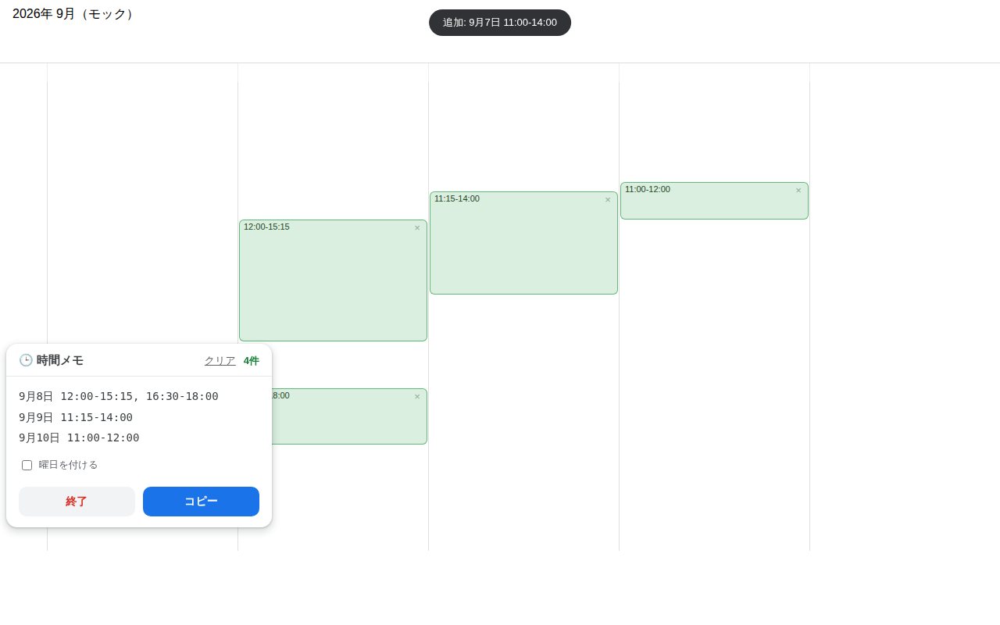

# Googleカレンダー 時間メモ（Chrome拡張）

Googleカレンダーの週表示・日表示で、空いている時間帯をマウスでドラッグするだけで、
メールにそのまま貼れる日程候補テキストに自動変換してくれるChrome拡張機能です。

```
9月7日 11:00-13:00
9月8日 12:00-15:15, 16:30-18:00
9月9日 11:15-14:00
```

カレンダーと睨めっこしながら日程候補を手で書き写す作業をなくします。



## インストール方法

1. このフォルダ（`gcal-time-memo`）を丸ごとPCにダウンロードする
2. Chromeで `chrome://extensions` を開く
3. 右上の「**デベロッパーモード**」をONにする
4. 「**パッケージ化されていない拡張機能を読み込む**」をクリックし、`gcal-time-memo` フォルダを選択する
5. [Googleカレンダー](https://calendar.google.com/) を開く（すでに開いていた場合はリロード）

## 使い方

1. Googleカレンダーを**週表示**または**日表示**にする
2. 画面右下の「🕒 時間メモ」ボタン（またはツールバーの拡張機能アイコン）をクリックしてモードを開始
3. カレンダー上の空き時間を**ドラッグで選択**する
   - 選択した時間帯が緑色のブロックとして記録され、「時間メモ」パネルに追加されます
   - 15分単位に自動でスナップします
   - 同じ日の重なった・隣接した選択は自動でひとつにまとまります
4. 候補を選び終えたら、パネルの「**コピー**」ボタンをクリック
   - `9月7日 11:00-13:00` 形式のテキストがクリップボードにコピーされるので、メールに貼り付けるだけ
5. 「**終了**」でモードを抜けます（記録した時間帯は保存され、次回開始時に復元されます）

### その他の操作

| 操作 | 説明 |
|---|---|
| 緑ブロックにマウスを乗せて「×」 | その時間帯だけ削除 |
| パネルの「クリア」 | 記録した時間帯を全削除 |
| 「曜日を付ける」チェック | `9月7日(月) 11:00-13:00` の形式に切り替え |
| パネルのヘッダーをドラッグ | パネルを好きな位置に移動 |

## 注意事項

- 対応しているのは**週表示・日表示**のタイムグリッドのみです（月表示・スケジュール表示ではドラッグ記録できません）
- 時間メモモード中は、カレンダー本来の「ドラッグで予定作成」は無効になります。「終了」を押せば元に戻ります
- Googleカレンダー側のDOM構造変更により動作しなくなる可能性があります

## ファイル構成

| ファイル | 役割 |
|---|---|
| `manifest.json` | 拡張機能の定義（Manifest V3） |
| `content.js` | カレンダー上のドラッグ検出・パネルUI・テキスト生成 |
| `content.css` | パネル・オーバーレイ・トーストのスタイル |
| `background.js` | ツールバーアイコンのクリックをタブに通知 |
| `icons/` | 拡張機能アイコン |
